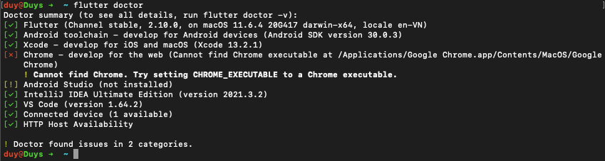
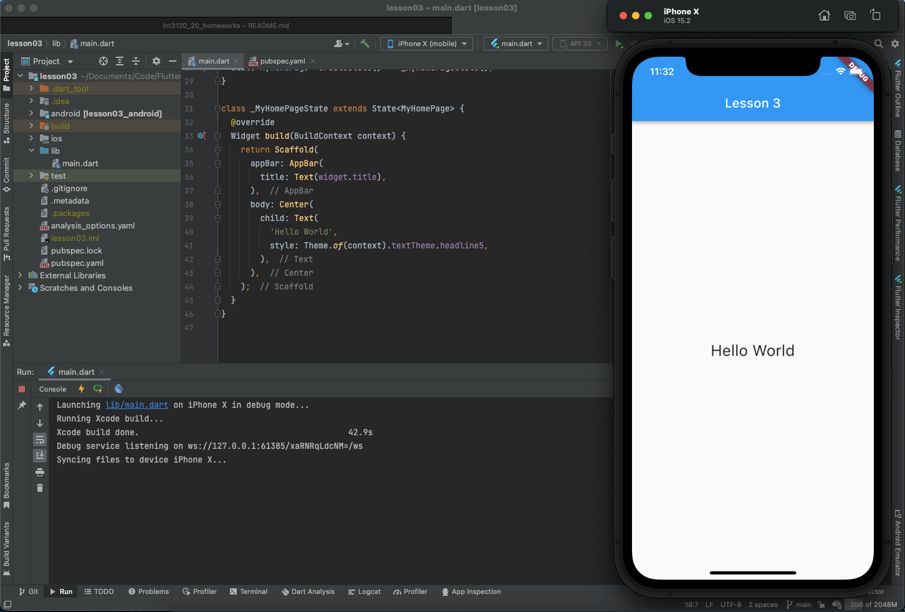
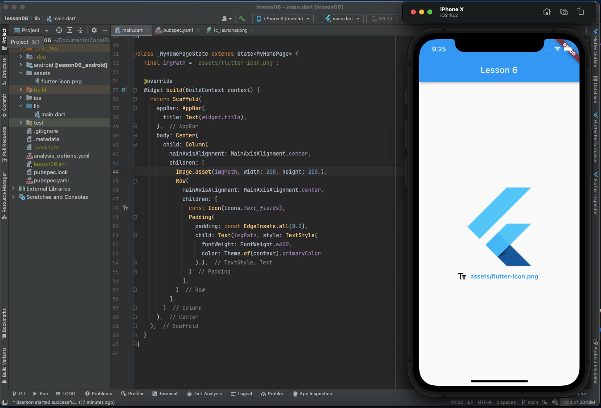
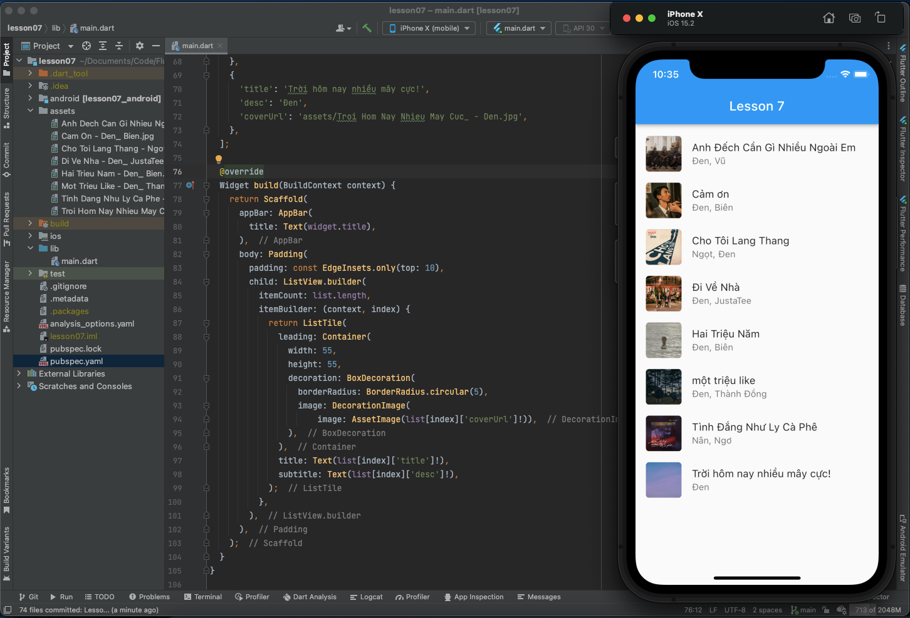

# int3120_20_homeworks

## Quá trình
### Tuần 1:
- Lesson 1: Tham khảo thông tin cơ bản về Flutter (Giới thiệu, tính năng, điểm mạnh,...)
- Lesson 2: Cài đặt, thiết lập môi trường phát triển

- Lesson 3: Hello World

- Lesson 4: Tìm hiểu về kiến trúc ứng dụng Flutter
  - 1 ứng dụng Flutter là tập hợp các widget, tất cả đều quy về các widget, các widget có thể gói trong các widget khác để mở rộng chức năng. Các widget này hoạt động ở những layer phía trên và sẽ phụ thuộc vào các layer phía dưới để tương tác với hệ điều hành
  - Có cả những widget đặc biệt để quản lí State (Stateful widget), bắt sự kiện cử chỉ (GestureDetector widget)
- Lesson 5: Tìm hiểu về Dart
  - Ngôn ngữ mã nguồn mở, đa năng, được phát triển bởi Google
  - Hướng đối tượng (hỗ trợ class, interface,...), cú pháp C (C-style)
  - Hỗ trợ các kiểu dữ liệu tường minh (Integer, Double, String, Boolean, List, Map) và cả kiểu dữ liệu động (chưa được định nghĩa tường minh) (dynamic)
  - Hỗ trợ các khối lệnh điều khiển thông dụng (if, if...else, switch) cũng như các vòng lặp thông dụng (for, while, do...while)
- Lesson 6: Widget trong Flutter
  - Widget trong Flutter được chia thành 4 nhóm
    - Platform widgets: Các widget đặc thù theo nền tảng. Được thế kế theo các triết lý khác nhau, Material widgets thiết kế theo Material design guideline và Cupertino widgets được thiết kế theo Human Interface Guidelines
    - Layout widgets: Các widget dùng để bố trí giao diện
    - State maintenance widgets: Các widget quản lý state
    - Platform independent / basic widgets: Các widget cơ bản độc lập với nền tảng sử dụng
  - Ứng dụng sử dụng một số widget cơ bản: 
    - Material widgets: Scaffold, AppBar
    - Platform independent widget: Text, Image, Icon
    - Layout widget: Center, Column, Row, Padding
  
- Lesson 7: Layout trong Flutter
  - Chia làm 2 loại chính dựa trên số widget con
    - Single Child Widgets - Chỉ có một widget con
    - Multiple Child Widgets - Có nhiều widget con
  - Ứng dụng sử dụng một số widget như: Scaffold, AppBar, Text, Padding, ListView, ListTile, Container, BoxDecoration, DecorationImage, AssetImage
  
- Lesson 8: Gesture trong Flutter
  - Một số cử chỉ phổ biến như: Tap, Double Tap, Drag, Flick, Pinch, Spread, Panning
  - Flutter cung cấp widget GestureDetector hỗ trợ xử lý các sự kiện dễ dàng
  - Ngoài ra, Flutter cũng cung cấp cơ chế xử lý sự kiện ở cấp thấp sử dụng Listener widget
  - Ứng dụng áp dụng GestureDetector để xử lý sự kiện hiện dialog khi bấm vào ảnh