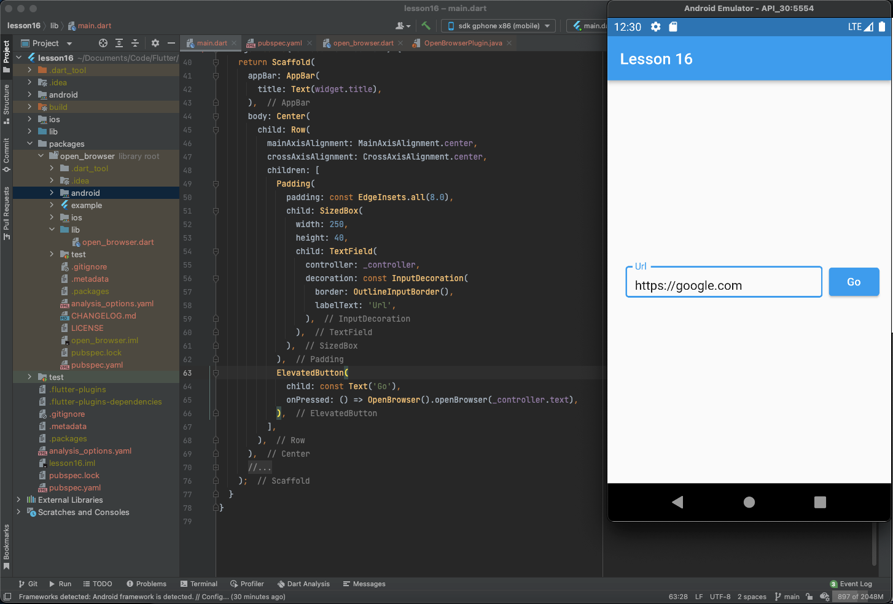
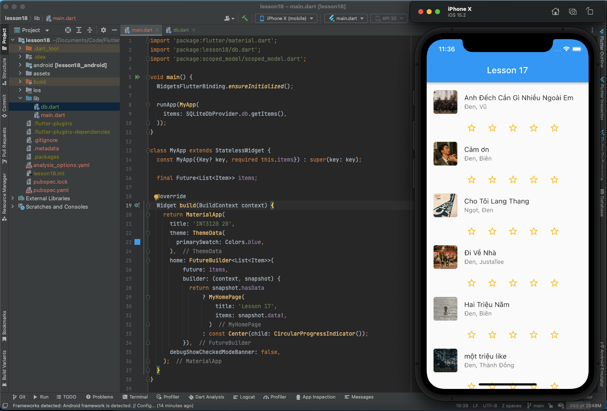
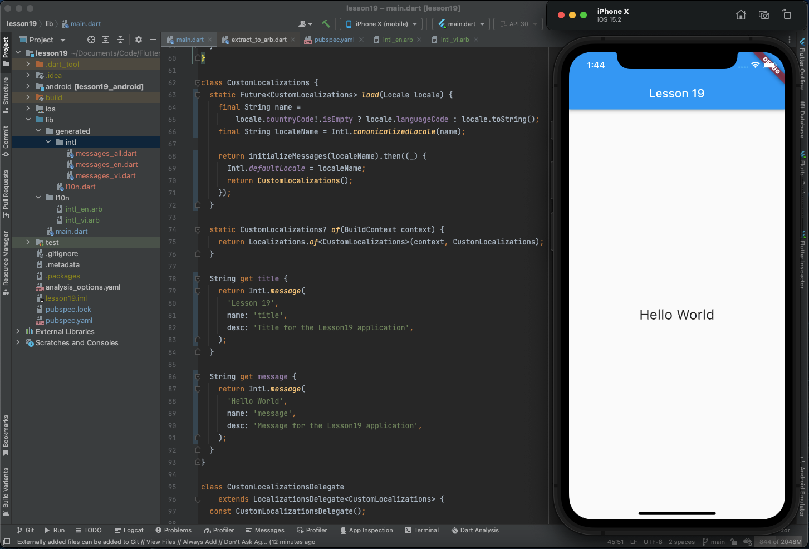

# int3120_20_homeworks

## Quá trình
### Tuần 1:
- Lesson 1: Tham khảo thông tin cơ bản về Flutter (Giới thiệu, tính năng, điểm mạnh,...)
- Lesson 2: Cài đặt, thiết lập môi trường phát triển

- Lesson 3: Hello World

- Lesson 4: Tìm hiểu về kiến trúc ứng dụng Flutter
  - 1 ứng dụng Flutter là tập hợp các widget, tất cả đều quy về các widget, các widget có thể gói trong các widget khác để mở rộng chức năng. Các widget này hoạt động ở những layer phía trên và sẽ phụ thuộc vào các layer phía dưới để tương tác với hệ điều hành
  - Có cả những widget đặc biệt để quản lí State (Stateful widget), bắt sự kiện cử chỉ (GestureDetector widget)
- Lesson 5: Tìm hiểu về Dart
  - Ngôn ngữ mã nguồn mở, đa năng, được phát triển bởi Google
  - Hướng đối tượng (hỗ trợ class, interface,...), cú pháp C (C-style)
  - Hỗ trợ các kiểu dữ liệu tường minh (Integer, Double, String, Boolean, List, Map) và cả kiểu dữ liệu động (chưa được định nghĩa tường minh) (dynamic)
  - Hỗ trợ các khối lệnh điều khiển thông dụng (if, if...else, switch) cũng như các vòng lặp thông dụng (for, while, do...while)
- Lesson 6: Widget trong Flutter
  - Widget trong Flutter được chia thành 4 nhóm
    - Platform widgets: Các widget đặc thù theo nền tảng. Được thế kế theo các triết lý khác nhau, Material widgets thiết kế theo Material design guideline và Cupertino widgets được thiết kế theo Human Interface Guidelines
    - Layout widgets: Các widget dùng để bố trí giao diện
    - State maintenance widgets: Các widget quản lý state
    - Platform independent / basic widgets: Các widget cơ bản độc lập với nền tảng sử dụng
  - Ứng dụng sử dụng một số widget cơ bản: 
    - Material widgets: Scaffold, AppBar
    - Platform independent widget: Text, Image, Icon
    - Layout widget: Center, Column, Row, Padding
  
- Lesson 7: Layout trong Flutter
  - Chia làm 2 loại chính dựa trên số widget con
    - Single Child Widgets - Chỉ có một widget con
    - Multiple Child Widgets - Có nhiều widget con
  - Ứng dụng sử dụng một số widget như: Scaffold, AppBar, Text, Padding, ListView, ListTile, Container, BoxDecoration, DecorationImage, AssetImage
  
- Lesson 8: Gesture trong Flutter
  - Một số cử chỉ phổ biến như: Tap, Double Tap, Drag, Flick, Pinch, Spread, Panning
  - Flutter cung cấp widget GestureDetector hỗ trợ xử lý các sự kiện dễ dàng
  - Ngoài ra, Flutter cũng cung cấp cơ chế xử lý sự kiện ở cấp thấp sử dụng Listener widget
  - Ứng dụng áp dụng GestureDetector để xử lý sự kiện hiện dialog khi bấm vào ảnh
  
- Lesson 9: Giới thiệu sơ bộ về quản lý State trong Flutter
  - Có thể chia làm 2 loại dựa trên thời gian tồn tại của state
    - Ephemeral (ngắn hạn): kéo dài trong thời gian ngắn, Flutter hỗ trợ quản lý state loại này thông qua StatefulWidget
    - App state (trạng thái ứng dụng): kéo dài trong toàn bộ app, Flutter hỗ trợ quản lý state loại này thông qua scoped_model
- Lesson 10: StatefulWidget trong Flutter
  - Widget được kế thừa từ StatefulWidget để duy trì trạng thái và quản lý các trạng thái của nó
  - Ứng dụng sử dụng StatefulWidget để làm RatingBox
  
- Lesson 11: ScopedModel trong Flutter
  - Flutter có package scoped_model hỗ trợ việc quản lý trạng thái ứng dụng. Package này cung cấp 3 class chính
    - Model: Model đóng gói trạng thái của một ứng dụng. Model có một phương thức duy nhất là notifyListeners, notifyListeners sẽ thực hiện các công việc cần thiết để cập nhật giao diện.
    - ScopedModel: Đây là widget giúp chuyển Data Model từ widget cha xuống các widget con đồng thời rebuild các widget con giữ các model khi các model được cập nhật
    - ScopedModelDescendant: Đây là widget lấy Data model từ lớp cha và build UI khi Data model thay đổi
  - Ứng dụng sử dụng scoped_model để thay cho StatefulWidget
  
- Lesson 12: Navigator và Routing
  - Flutter cung cấp cho chúng ta lớp routing cơ bản là MaterialPageRoute cùng với hai phương thức Navigator.push() và Navigator.pop()
    - MaterialPageRoute: Đây là widget dùng để render màn hình mới, có thể đi cùng với một hiệu ứng chuyển cảnh nào đó
    - Navigation.push(): Đây là phương thức dùng để chuyển sang màn hình mới
    - Navigation.pop(): Đây là phương thức dùng để quay lại màn hình trước đó
  - Ứng dụng áp dụng routing để chuyển sang màn hình chi tiết của Item khi bấm vào Item đó
  
### Tuần 2:
- Lesson 13: Animation
  - Flutter animation dựa trên các đối tượng animation. Lõi của các lớp animation nó hoạt động như sau:
    - Animation: 
      - Tạo ra giá trị và được thêm vào giữa hai số (bắt đầu và kết thúc animation). Các kiểu animation thường được sử dụng là: Animation<double>, Animation<Color>, Animation<Size>
      - AnimationController: đối tượng animation đặc biệt dùng để điều khiển các hiệu ứng của chính nó. Nó tạo ra các giá trị mới bất cứ khi nào ứng dụng sẵn sàng cho một frame mới, hỗ trợ các animation tuyến tính
    - CurvedAnimation: cơ bản giống như AnimationController nhưng hỗ trợ animation phi tuyến tính
    - Tween<T>: kế thừa từ Animatable<T> và tạo các giá trị bất kì khác 0 và 1. Nó được sử dụng cùng với đối tượng animation bởi phương thức animate()
  - Demo:
  
- Lesson 14: Code với native Android
  - Flutter cung cấp framework chung để truy cập vào các nền tảng có tính năng riêng biệt thông qua giao thức đơn giản là messaging. Client (Flutter code), mã nền tảng và Host liên kết với một thông báo chung gọi là Message Channel
  - Demo:
  
  
- Lesson 15: Code với native iOS
  - Việc truy cập vào các nền tảng riêng của hệ điều hành iOS cũng giống như Android nhưng ta sẽ sử dụng Objective-C hay Swift và iOS SDK
  - Demo:
  
  
- Lesson 16: Giới thiệu về package
  - Dart Package là một thư viện hay mô hình đơn giản có thể chia sẻ. Về cơ bản, Dart Package tương tự Dart Application, tuy nhiên nó không truy cập vào các điểm chính của ứng dụng
  - Các kiểu package:
    - Dart package: có thể sử dụng trên nhiều môi trường
    - Flutter package: phụ thuộc vào Flutter framework, có thể chỉ sử dụng trong môi trường mobile
    - Flutter plugin: phụ thuộc vào Flutter framework và cả nền tảng (iOS SDK hay Android SDK)
  - Demo:
  
  
  
- Lesson 17; REST API
  - Flutter cung cấp package http, http là một thư viện Future-based sử dụng await và async. Nó cung cấp phương thức cấp cao và đơn giản để phát triển REST
    - Lớp http cung cấp chức năng để làm việc với tất cả các kiểu dữ liệu HTTP được request
    - Phương thức http có sử dụng url, và bổ sung thông tin thông qua Dart Map
  - Một vài phương thức chính:
    - read: gửi yêu cầu sử dụng phương thức GET và trả về Future<String>
    - get: gửi yêu cầu sử dụng phương thức GET và trả về Future<Response>. Response là lớp giữ lại các thông tin phản hồi
    - post: gửi yêu cầu sử dụng phương thức POST, đưa giá trị lên sever và phản hồi Future<Response>
    - put: gửi yêu cầu sử dụng phương thức PUT và trả về phản hồi Future<Response>
    - head: gửi yêu cầu sử dụng phương thức HEAD và trả về phản hồi Future<Response>
    - delete: gửi yêu cầu sử dụng phương thức DELETE và trả về phản hồi Future<Response> 
  - Demo (yêu cầu chạy http server tại thư mục JSONWebServer và thay địa chỉ tại dòng 23 tệp main.dart):
  
  
- Lesson 18: Database
  - Flutter hỗ trợ 1 vài gói để làm việc với cơ sở dữ liệu (database), ví dụ như: sqflite (SQLlite database), firebase_database (NoSQL database từ Google)
  - SQLite: là một SQL tiêu chuẩn dựa trên công cụ cơ sở dữ liệu nhúng. Gói sqflite cung cấp nhiều chức năng để làm việc hiệu quả với SQLite database. Gói sqflite có các chức năng chính như:
    - Tạo/mở SQLite database
    - Thực thi SQL statement
    - Phương thức truy vấn nâng cao
  - Demo SQLite:
  
  
  - Cloud Firestore: Firebase là nền tảng phát triển ứng dụng Baas(Backend-as-a-Service), cung cấp nhiều tính năng để hỗ trợ việc phát triển ứng dụng như xác thực, lưu trữ đám mây,... Trong đó có thể kể đến Cloud Firestore dựa trên NoSQL database với thời gian thực
  - Demo Firestore:
    - Yêu cầu tự thiết lập firebase project theo từng bước sau đây:
      - Mở [Firebase](https://firebase.google.com)
      - Tạo một tài khoản Firebase và tạo Project
      - Các bạn làm theo hướng dẫn chi tiết trong video này nhé: [Hướng dẫn](https://www.youtube.com/watch?v=6juww5Lmvgo)
      - Lưu ý: hãy nhớ cần kết nối project với firebase nhé
      - Đi đến Firebase console
      - Mở project mình vừa tạo
      - Nhấn vào tính năng Database trong menu bên trái
      - Tạo database
      - Nhấn Start trong test mode và Enable
      - Click Add collection. 
      
    - Ứng dụng:
    
    
### Tuần 3:
- Lesson 19: Chuyển đổi ngôn ngữ
  - Hiện nay, các ứng dụng có thể được sử dụng từ nhiều nơi trên thế giới, vì thế các ứng dụng phải hiển thị nội dung phù hợp với ngôn ngữ của quốc gia đó
  - Flutter hỗ trợ ứng dụng làm việc với đa ngôn ngữ (Internationalizing). Trong đó, có thể kể đến 3 lớp localization:
    - Locale: lớp được sử dụng để nhận diện ngôn ngữ người sử dụng
    - Localizations: widget chung được sử dụng để set Locale và nguồn localized của lớp con
    - LocalizationsDelegate<T>: lớp factory thông qua widget Localizations được tải. Nó có 3 phương thức overridable như sau:
      - isSupported: Chấp nhận một biến kiểu Locale và kiểm tra locale đó có được hỗ trợ không
      - load: Chấp nhận ngôn ngữ được chọn và tải dữ liệu tương ứng ngôn ngữ đó
      - shouldReload: Liệu có nên tải lại khi widget Localizations được rebuild
  - Demo (Manual - flutter_localizations - the first Lesson 19 commit):
  
  
  - Demo (intl - the second Lesson 19 commit):
  
  
